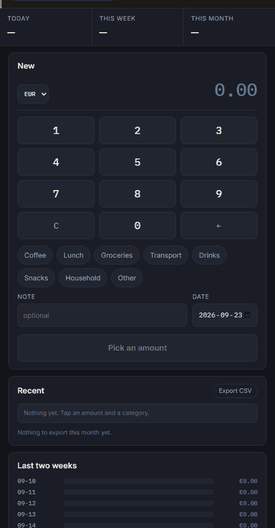

# Tally — record what you spent, in the seconds after you spend it

[](LICENSE)
[](https://www.python.org/)
[](tests/)
[](.coveragerc)

A bank export arrives days late, and by then you no longer remember what the
€14.20 was for. So: tap an amount on a keypad, tap a category, done. Two taps
for anything you buy often.

### ▶ [Try it now — runs in your browser, nothing to install](https://luke-zhang-cs-py.github.io/tally/app/)



**[Read the overview →](https://luke-zhang-cs-py.github.io/tally/)**
— the six decisions and what each one is avoiding, and every bug this thing
has had. (Or open [`docs/index.html`](docs/index.html) locally.)

## Run it

```bash
pip install -r requirements.txt
python app.py            # http://127.0.0.1:5005
```

Everything stays on your machine — no account, no bank connection, no API key.
To use it from your phone, set `HOST=0.0.0.0` and open
`http://<your-laptop-ip>:5005`. **There is no login**, so a home network is
fine and a café is not; the app prints that warning on startup.

## The decisions worth knowing

**A keypad, not a text field.** Digits shift in from the right the way a till
works: `3`, `5`, `0` gives `3.50`. No decimal point to place and none to get
wrong, and no keyboard to wait for.

**Two taps for a habit.** Anything bought three or more times in 90 days
becomes a one-press button carrying its own amount, category and note. A habit
is a category *and* an amount — "Coffee" is no shortcut if it's sometimes 2.50
and sometimes 18.

**Currencies are never added together.** A day with €12 and CA$8 shows both,
stacked. Summing them needs a rate this app doesn't have, and inventing a
total would be worse than showing two.

**Money is an integer number of cents.** `0.1 + 0.2` is `0.30000000000000004`,
so a float total disagrees with the entries printed above it — and a reader who
notices that stops trusting every other figure on the screen.

**Dates are dates, not timestamps.** `datetime` subclasses `date`, so a
timestamp passes an `isinstance` check untouched and stores as
`2026-08-31T14:30:00` — which sorts *after* `2026-08-31`, quietly dropping an
expense from its own month's total. It's coerced, and a test pins it.

## It feeds the wallet app

[Wallet](https://github.com/luke-zhang-cs-py/Budgeting-EU-to-CAD-USD-Automatic)
does the other half — reconciling against a bank export and converting at the
rate that applied on the day. `/export.csv` uses exactly the four column names
its importer expects, so it imports with no column mapping:

```
Date,Description,Amount,Currency
2026-09-08,Coffee - Cafe Nero,-3.50,EUR
```

`tests/test_export.py` reads the wallet app's own header list and fails if
either side renames a column — the repos are independent, and nothing else
would notice.

## The browser build

[`docs/app/`](docs/app/) is the same app with the browser standing in for the
server: the same `templates/index.html`, `static/css/style.css` and
`static/js/app.js`, copied byte for byte by `tools/build_static.py` and never
forked. Tally's server is persistence and nothing else, so persistence is the
only part replaced — `db.py`, `entries.py` and `export.py` ported to
`localStorage`, behind a shim answering the routes `app.js` already calls.

```bash
python tools/build_static.py
```

Entries live in one browser on one device; clearing site data deletes them. The
CSV export is the way out.

**What it isn't allowed to give up is the arithmetic.** The published copy is
the one most people open, and it runs a second implementation of the money code
that nothing in `tests/` ever loads — so a port that quietly reintroduced a
float would be invisible exactly where it matters most. The build therefore
starts a real browser, loads the JavaScript it's about to publish, and runs it
against the Python: every value through `parse`/`format`/`plain`/`total`
including error wording, one fixture loaded into both SQLite and localStorage
with every payload compared field by field, and the whole list of HTTP requests
replayed against both. Any disagreement and nothing is written.

That has already paid for itself twice: a `window.localStorage` read outside
its try/catch that left the store undefined in a private window, and a `?limit=`
parsed with `Number()` where `app.py` uses `int()`.

## Layout

```
app.py        the Flask entry point, and the only module left in the root
core/         paths.py, db.py      where the data lives, and the one table
domain/       money.py, entries.py, export.py
              the rules: integer cents, recording and querying, the CSV
tools/        the browser build and the figure refresh
```

`app.py` stays at the root because `Flask(__name__)` resolves `templates/` and
`static/` relative to its own directory. `core/paths.py` resolves the data
directory two levels up for the same reason it exists at all: `data/` belongs
beside the project, not inside a package.

## Your data

`data/tally.db`, a SQLite file, and nothing else. `data/`, `*.db` and `*.csv`
are all gitignored. Point it elsewhere with `TALLY_DATA=/path/to/folder`.

## Tests

```bash
pytest -q
```

145 tests, 96% of 326 statements — both figures checked against the repo, because
a number typed into a file goes stale the moment a test is added.

The suite isn't there for the number. Everything it asserts is something that
was got wrong first: a minus sign that silently recorded a positive expense, a
formatter that answered `""` for a null, a queue that doubled on retry.

## License

MIT. See [LICENSE](LICENSE).
